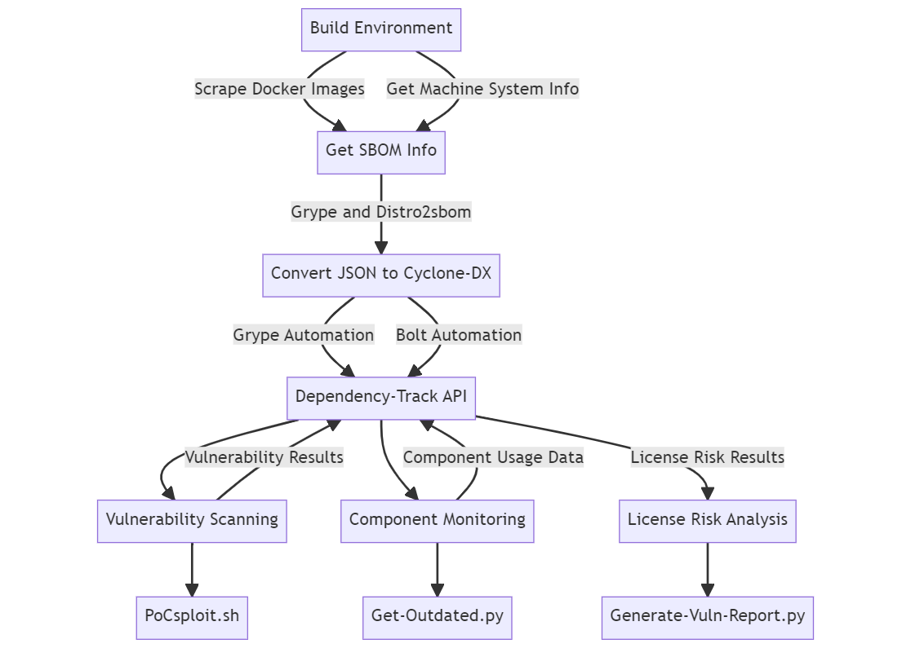

# Project Description

This project tests the viability of managing IT infrastructure using the continuous Software Bill of Materials (SBOM) platform Dependency-Track. The task involved building a scalable environment to mimic a large IT network comprised of several thousand virtual machines. 

This was achieved through a host of automated processes which pulled system information from Docker images using [Grype](https://anchore.com/opensource/) and local machines using [Distro2sbom](https://pypi.org/project/distro2sbom/). The tools then convert this information to CycloneDX json formatted files for further processing. The image SBOM-to-Dependency-Track pipeline was executed through Grype. The local machine SBOM-to-Dependency-Track pipeline was controlled by the automation tool [Bolt](https://www.puppet.com/community/open-source/bolt). 

### Project Pipeline

BOMs are scanned by Dependency-Track for vulnerabilities as part of the upload process. This can also be done by Grype, but these scans but are not supported.

## Capabilities

A large part of the infrastructure management process can be done within Dependency Track. It is capable of monitoring component usage across all versions of every application in its portfolio. It can identify components with known vulnerabilities, components which are out of date, modified components and license risks.

The following capabilities were tested:

* SBOM generation via Grype and Distro2sbom
* Inventory management
* Linux Packet, library and software enumeration
* Docker container enumeration
* Vulnerability notifications
* Vulnerability feed collection
* Comparing enumeration results with vulnerability feeds to generate alerts

### Custom Scripts

Scripts were designed to reduce the need to navigate the UI and to provide the possibility to cross-reference components and projects. The `get-outdated`script lists all component versions and compares them to the latest version available. This enables the use of `grep` to source information about multiple components simultaneously. This is not easily done in the UI. 

Another script, `generate-vuln-report`, organises projects into a table formatted according to their CVSS and EPSS scores. Finally, `pocsploit` fetches information from Dependency-Track API about known exploited vulnerabilities and the projects they affect. These are then checked against exploits available at Exploit-DB and a centralised GitHub PoC exploit repository housing PoCs dating back to 1999.
